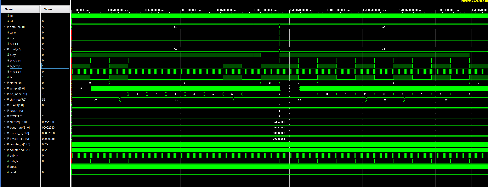

# Verilog UART

A UART (Universal Asynchronous Receiver Transmitter) implemented in Verilog HDL featuring an FSM-based transmitter, receiver, parameterized baud-rate generator, and simulation testbench.

## Features
- 8-bit UART (8N1)
- 16× oversampling receiver
- Parameterized baud-rate generator
- FSM-based TX/RX design
- Synthesizable RTL
- Vivado simulation verified

## Tools
- Verilog HDL
- Xilinx Vivado

## Simulation

Successfully transmitted and received:
- `0x41`
- `0x55`

The testbench verifies successful UART loopback communication by transmitting and receiving multiple bytes (`0x41` and `0x55`) at 9600 baud.
